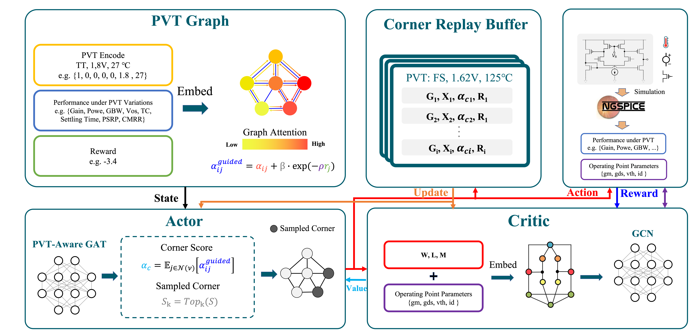

# PVT-GAT: Robust Circuit Optimization Framework using Graph Attention and Multi-Task RL

<p align="center">
  
</p>

This repository contains the implementation of our paper: **"PVT-GAT: A Robust Circuit Optimization Framework via Graph Attention Networks and Multi-Task Reinforcement Learning"**.

## Overview

We propose a circuit optimization framework that achieves robust full-specification performance under Process, Voltage, and Temperature (PVT) variations. Our approach combines Graph Attention Networks (GAT) with multi-task Reinforcement Learning to dynamically identify and prioritize critical PVT corners during the optimization process.

## Key Features

- **PVT Graph Representation**: Fully-connected graph representation of PVT corners with feature encoding
- **PVT-Aware GAT**: Custom Graph Attention Network that adaptively focuses on performance bottlenecks
- **Attention-Based Sampling**: Efficient PVT corner selection strategy that reduces simulation overhead
- **Multi-Task RL Architecture**: Actor-Critic framework with attention-weighted loss functions

## Framework Architecture

Our framework operates through several integrated components:

1. **PVT Variations Graph**: Constructs a comprehensive model of the PVT space
2. **Actor Network**: Employs PVT-aware GAT to generate circuit design parameters
3. **Critic Network**: Evaluates design robustness across PVT variations
4. **Guided Attention Mechanism**: Prioritizes critical corners with performance bottlenecks
5. **Selective Sampling Strategy**: Intelligently chooses representative corners for simulation

## Usage

```python
from pvt_gat import PVTGATOptimizer

# Initialize the optimizer
optimizer = PVTGATOptimizer(
    circuit_netlist='path/to/circuit.spice',
    pvt_corners={
        'tt_27_1p0': {'process': 'tt', 'temp': 27, 'vdd': 1.0},
        'ss_125_0p9': {'process': 'ss', 'temp': 125, 'vdd': 0.9},
        # Add more PVT corners...
    },
    performance_specs={
        'gain': {'min': 60, 'unit': 'dB'},
        'bandwidth': {'min': 10e6, 'unit': 'Hz'},
        # Add more specs...
    }
)

# Custom attention mechanism parameters
optimizer.configure_attention(
    guided_weight=0.8,  # β parameter in the paper
    sensitivity=5.0     # ρ parameter in the paper
)

# Custom RL hyperparameters
optimizer.configure_rl(
    actor_lr=1e-4,
    critic_lr=1e-3,
    gamma=0.99,
    buffer_size=10000,
    batch_size=64
)

# Run optimization
results = optimizer.optimize(
    max_iterations=10000,
    attention_sampling_k=5  # Number of corners to sample in each iteration
)
```


## Experiment Results


## License

This project is licensed under the MIT License - see the [LICENSE](LICENSE) file for details.
