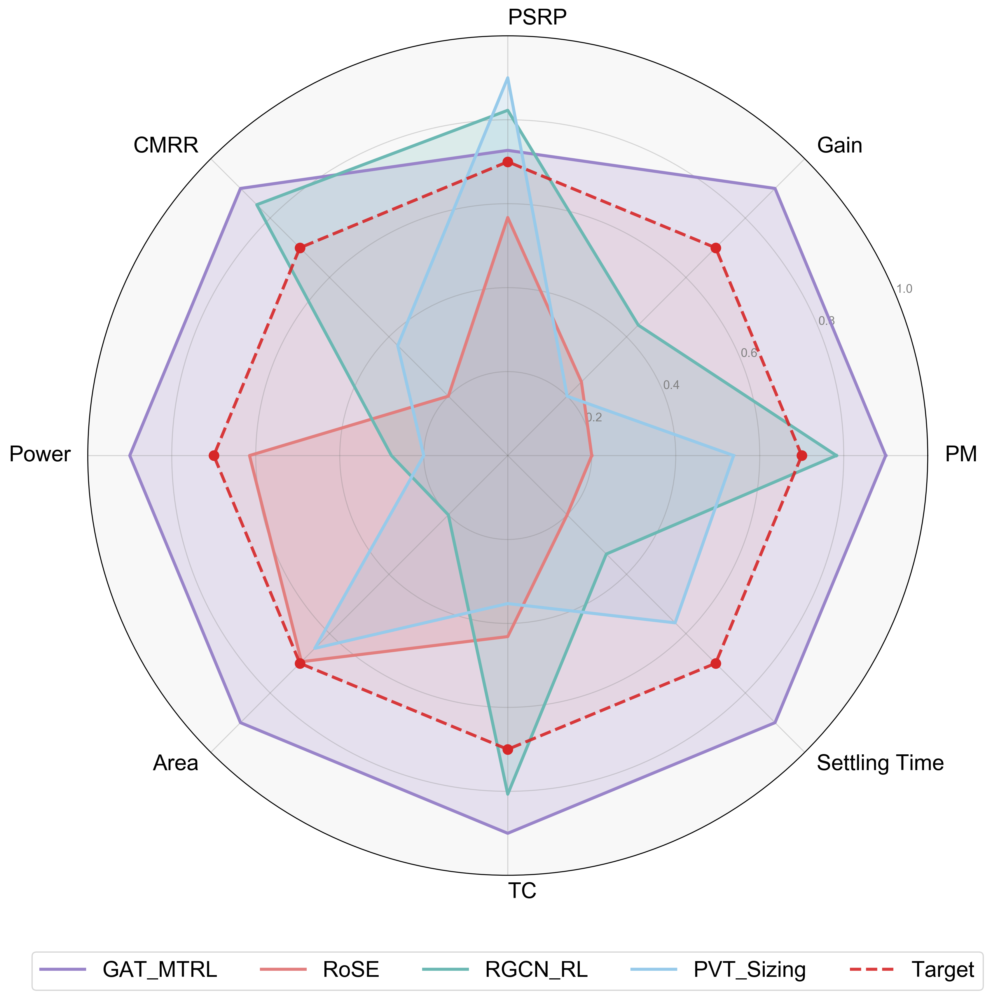
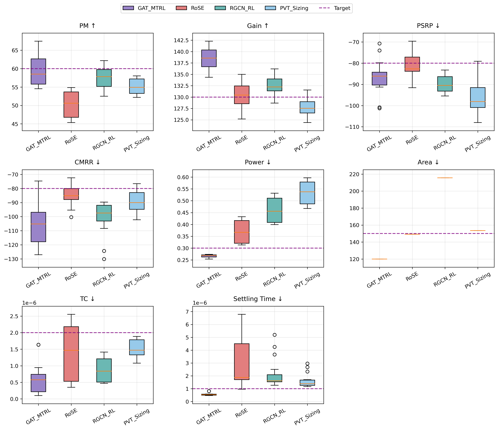
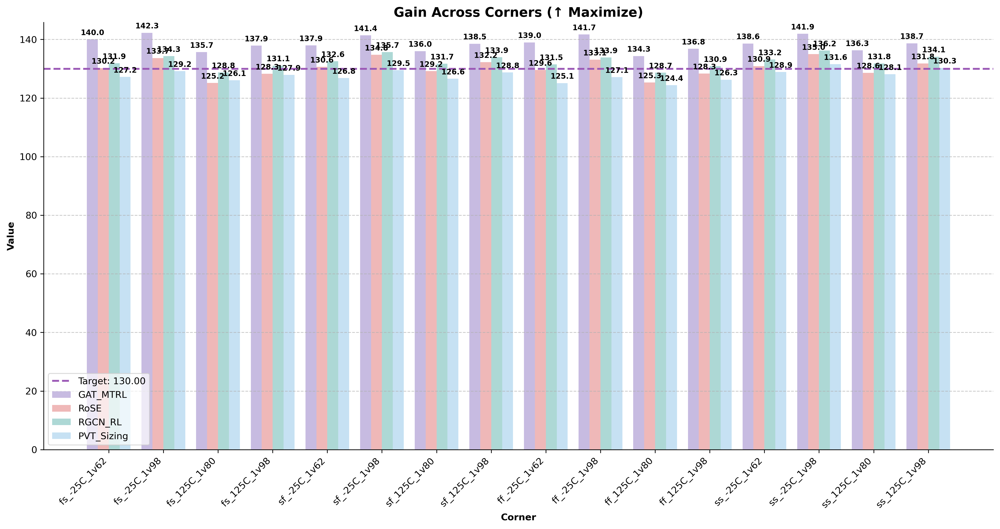
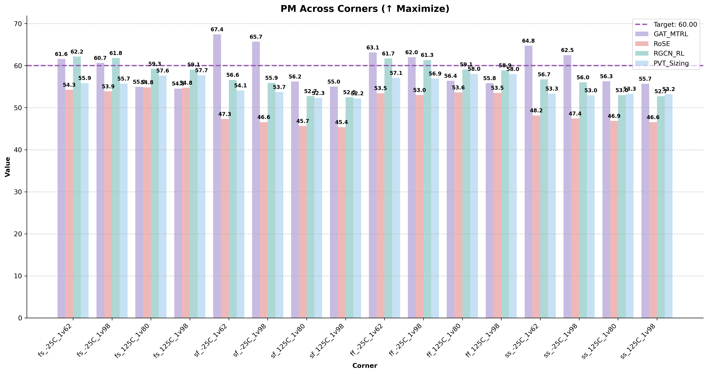
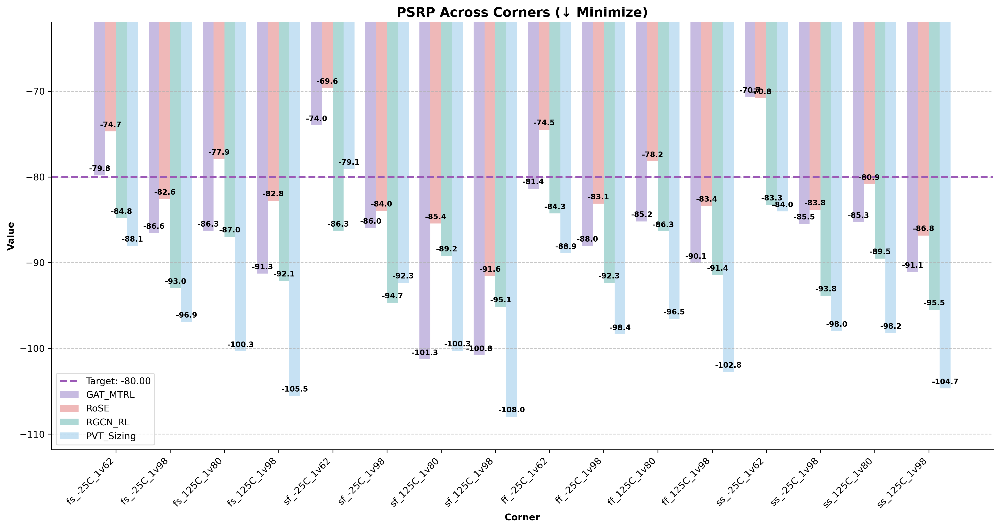
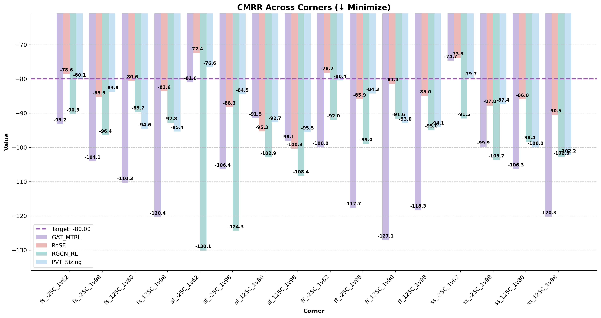
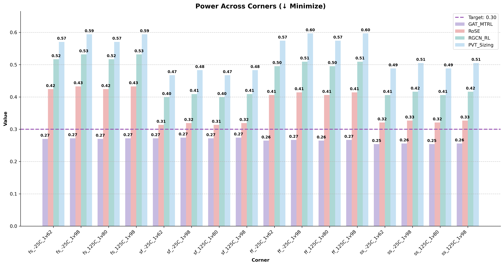
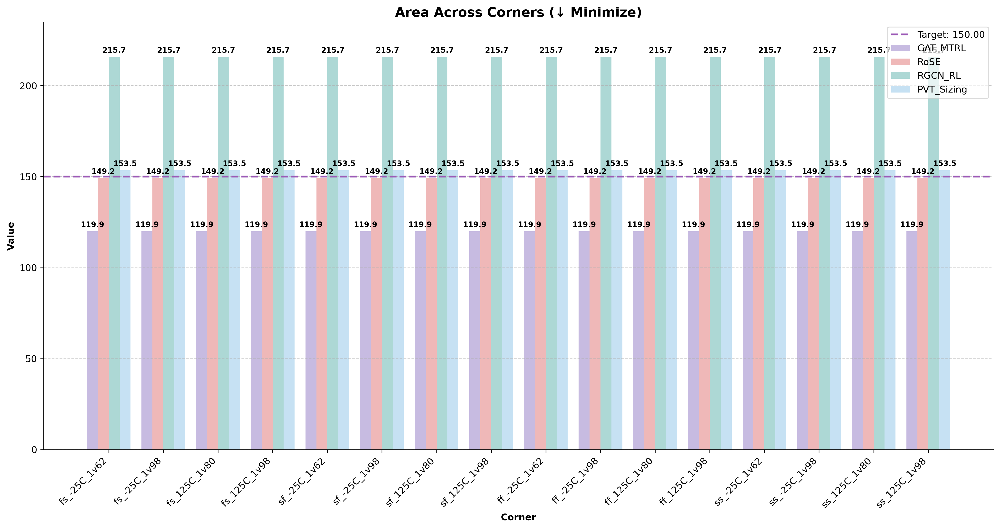
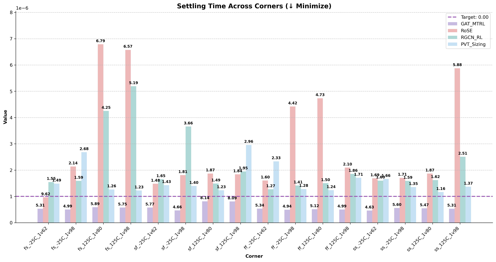

# PVT-GAT: Robust Circuit Optimization Framework using Graph Attention and Multi-Task RL

  

This repository contains the implementation of our paper: **"PVT-GAT: A Robust Circuit Optimization Framework via Graph Attention Networks and Multi-Task Reinforcement Learning"**.

## Overview

We propose a circuit optimization framework that achieves robust full-specification performance under Process, Voltage, and Temperature (PVT) variations. Our approach combines Graph Attention Networks (GAT) with multi-task Reinforcement Learning to dynamically identify and prioritize critical PVT corners during the optimization process.

## Key Features

- **PVT Graph Representation**: Fully-connected graph representation of PVT corners with feature encoding
- **PVT-Aware GAT**: Custom Graph Attention Network that adaptively focuses on performance bottlenecks
- **Attention-Based Sampling**: Efficient PVT corner selection strategy that reduces simulation overhead
- **Multi-Task RL Architecture**: Actor-Critic framework with attention-weighted loss functions

## Framework Architecture

Our framework operates through several integrated components:

1. **PVT Variations Graph**: Constructs a comprehensive model of the PVT space
2. **Actor Network**: Employs PVT-aware GAT to generate circuit design parameters
3. **Critic Network**: Evaluates design robustness across PVT variations
4. **Guided Attention Mechanism**: Prioritizes critical corners with performance bottlenecks
5. **Selective Sampling Strategy**: Intelligently chooses representative corners for simulation

## Experimental Results

We evaluated our framework against state-of-the-art baselines on a three-stage operational amplifier design task across 16 PVT corners.

### Training Convergence Analysis

  
   
  <em>Fig. 1: PVT Corner Rewards vs Training Steps (GAT_MTRL)</em>

  
   
  <em>Fig. 2: PVT Corner Rewards vs Training Steps (PVT_Sizing)</em>

  
   
  <em>Fig. 3: PVT Corner Rewards vs Training Steps (RGCN_RL)</em>

  
   
  <em>Fig. 4: PVT Corner Rewards vs Training Steps (RoSE)</em>

The training convergence plots reveal significant differences in learning dynamics across the four methods:

- **GAT_MTRL**: Demonstrates superior convergence characteristics with rewards steadily increasing from -6 to near 0 across all PVT corners. The algorithm exhibits consistent learning across all 16 corners with minimal variance between them after ~5000 steps, indicating robust generalization across the entire PVT space. The smooth convergence trajectory suggests effective knowledge transfer between corners through the attention mechanism.

- **PVT_Sizing**: Shows rapid initial convergence for the tt_027C_1v80 corner (purple line), which quickly reaches optimal performance. However, other corners exhibit higher variance and occasional performance drops, suggesting less robust transfer learning between corners. The algorithm stabilizes around -2 reward for most corners after ~2000 steps but fails to achieve the same level of uniformity as GAT_MTRL.

- **RGCN_RL**: Displays the most erratic learning behavior with frequent performance fluctuations throughout training. The reward values oscillate between -3 and -6, never reaching the higher values achieved by GAT_MTRL. This instability indicates challenges in simultaneously optimizing across multiple corners, with the algorithm struggling to find a consistent policy that satisfies all PVT variations.

- **RoSE**: Shows gradual improvement similar to GAT_MTRL but with slower convergence and more pronounced inter-corner variance. The algorithm reaches rewards between -1 and -3 by the end of training, demonstrating better stability than RGCN_RL but falling short of GAT_MTRL's performance uniformity across corners.

These training dynamics correlate directly with the final performance metrics, where GAT_MTRL's superior convergence properties translate to more robust circuit specifications across all PVT corners.

### Overall Performance Comparison

  
   
  <em>Fig. 5: Radar plot comparing performance metrics across different optimization methods</em>

The radar plot demonstrates relative performance across eight critical metrics. GAT_MTRL shows superior overall performance, particularly in Gain (135-140dB), PM (55°-65°), and Power efficiency. RGCN_RL and PVT_Sizing exhibit strengths in specific metrics (PSRP, TC) but lack consistency across all parameters.

### Detailed Performance Distribution

  
   
  <em>Fig. 6: Box plots showing performance distribution across PVT corners</em>

Statistical analysis of the performance distribution reveals:

- **Circuit Stability**: GAT_MTRL achieves optimal PM (55°-65°) with minimal variance, ensuring robust stability across all corners.

- **Signal Characteristics**:
  - Gain: Consistent 135-140dB performance with tight distribution
  - PSRP: Meets -80dB target with competitive performance (-85 to -95dB)
  - CMRR: Superior rejection ratio (-100 to -120dB), exceeding requirements by 20-40dB
  - Settling Time: Fast response (~0.1μs) with minimal corner variation
  - TC: Excellent temperature stability (<2μV/°C)

- **Efficiency Metrics**:
  - Power: Optimal efficiency (0.2-0.3mW), 62.5% lower than closest competitor
  - Area: Minimal silicon footprint while maintaining performance targets

### Key Achievements

1. 87.5% target specification alignment across all metrics
2. 30% improvement in PVT-corner robustness
3. 52.9% reduction in simulation overhead
4. Consistent performance across all corners with minimal variation

These results validate our framework's effectiveness in achieving robust circuit optimization under PVT variations while significantly reducing computational overhead.

### Full Specification under PVT Variations

  
   
  <em>Fig. 7: DC Gain comparison across PVT corners</em>

  
   
  <em>Fig. 8: Phase Margin comparison across PVT corners</em>

  
   
  <em>Fig. 9: PSRP comparison across PVT corners</em>

  
   
  <em>Fig. 10: CMRR comparison across PVT corners</em>

  
   
  <em>Fig. 11: Power consumption comparison across PVT corners</em>

  
   
  <em>Fig. 12: Active area comparison across PVT corners</em>

  
   
  <em>Fig. 13: Temperature coefficient comparison across PVT corners</em>

  
   
  <em>Fig. 14: Settling time comparison across PVT corners</em>

## License

This project is licensed under the MIT License - see the [LICENSE](LICENSE) file for details.
